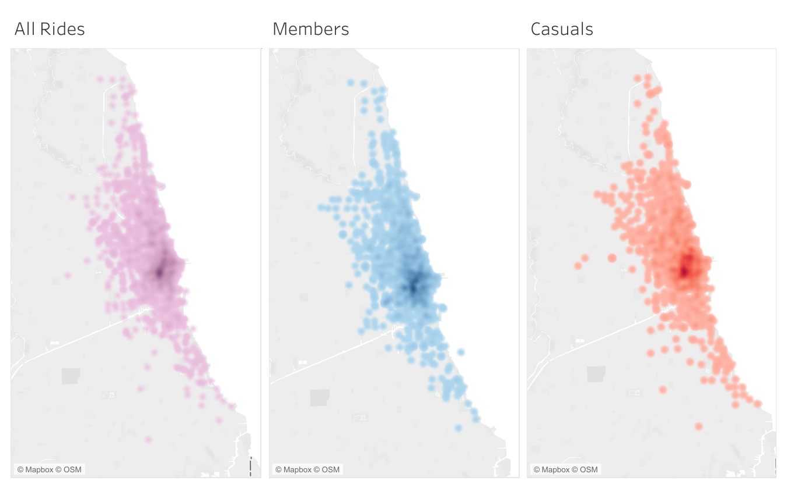

# Purpose

I'm analyzing the data of Cyclistics, a bike-share company in Chicago, over a year's time to help the manager of marketing better understand their customers. The cycling company rents out ride-share bikes in a metropolitan area. There are two types of customers, those who pay an annual fee and can ride anytime they like, called members, and those who pay a one-time fee whenever they wish to ride, called casuals.

I am specifically tasked with identifying key differences between how members use the bikes and how casuals use the bikes. I plan to compare the number of rides taken by members and casuals across the calendar year and see if any patterns or insights arise. I also intend to compare ride times, as perhaps one group uses a bike significantly longer than the other group. Lastly, since I've been given the latitude and longitude of the starting and ending points of each ride, I can make a density map to compare and contrast users' habits.

Any insights I find will be used by Cyclistics' marketing manager to make a decision about future ad campaigns.

# Findings and Recommendations

My analysis produced the following findings:

- Casual riders tended to ride more on the weekend than weekdays, while members' ridership remained steady from weekend to weekday
- Casual riders tended to rent their bikes for longer periods of time than members, with the highest mean ride times in the warmer months (May through August)
- Casual riders' mean ride time per rental varied dramatically, from nearly 45 minutes in July to just over 20 minutes in January; members' mean ride time did not vary so dramatically, staying between 20 and 13 minutes all year long
- There was no significant geographical difference in member usage and casual usage

Based on these findings, I recommend the marketing team build an ad campaign that emphasizes the following:

- the value of using bike-shares during the week, not just on weekends
- the attractiveness of using bike-shares during non-summer months
- the convenience of using bike-shares for shorter excursions

Developing an ad campaign that reflects each of the above would effectively amplify the most notable trends found in the analysis of the last year's data.

# Preparing the Data for Analysis

The dataset included 12 `.CSV` files, one file for each month in a calendar year. Those 12 files totaled over 3 million rows of data across a dozen or so columns. With such a large dataset I decided to first manipulate the data using SQL. I used the Postico app to import the dataset into a PostgreSQL database and to run queries.

## Combining the datasets

For my purposes, I wanted to combine all 12 `.CSV` files into one table and analyze all the data at once. As stated above, I had already imported all 12 files into the database. Each file had the title `mmmmmmmm_yyyy`.

```
SELECT * INTO may_2020_through_april_2021
FROM (
  SELECT * FROM apriL_2021
  UNION ALL
  SELECT * FROM march_2021
  UNION ALL
  SELECT * FROM february_2021
  UNION ALL
  SELECT * FROM january_2021
  UNION ALL
  SELECT * FROM december_2020
  UNION ALL
  SELECT * FROM november_2020
  UNION ALL
  SELECT * FROM october_2020
  UNION ALL
  SELECT * FROM september_2020
  UNION ALL
  SELECT * FROM august_2020
  UNION ALL
  SELECT * FROM july_2020
  UNION ALL
  SELECT * FROM june_2020
  UNION ALL
  SELECT * FROM may_2020) AS all_data;
```

I also knew I would want the duration of each ride, so I created a new table with an added column called `ride_time`. In this table I dropped extraneous columns that I did not need for my analysis, including latitude and longitude of the pick-up and drop-off locations. I also added columns for `month`, `year`, and `full_date`, `day`, and `weekday`.

```
SELECT
	to_char(started_at, 'MM/DD/YYY') AS full_date,
	to_char(started_at, 'YYYY') AS year,
	TRIM(to_char(started_at, 'Month')) AS month,
	DATE_PART('day', started_at) AS day,
	TRIM(to_char(started_at, 'Day')) AS weekday,
	member_casual,
	ended_at - started_at AS ride_time
FROM may_2020_through_april_2021
GROUP BY ride_id, full_date, to_char(started_at, 'YYYY'), to_char(started_at, 'Month'),   DATE_PART('day', started_at), to_char(started_at, 'Day'), member_casual, ended_at - started_at;

```

I stored this table as `all_ride_times`. Note: I had to use the `TRIM()` function because the `TO_CHAR()` function returns a set number of characters, regardless of what the return value is, leaving unnecessary trailing spaces.

Another table I wanted to include would be a table that would aggregate the number of rides taken each day. Such a table would be useful when I look for averages and try to plot the data later on. I accomplished this with the following query:

```
SELECT
	to_char(started_at, 'MM/DD/YYY') AS full_date,
	to_char(started_at, 'YYYY') AS year,
	to_char(started_at, 'Month') AS month,
	DATE_PART('day', started_at) AS day,
	to_char(started_at, 'Day') AS weekday,
	COUNT(ride_id) AS ride_count,
	COUNT(CASE WHEN member_casual = 'member' THEN 1 END) AS member_rides,
	COUNT(CASE WHEN member_casual = 'casual' THEN 1 END) AS casual_rides
FROM may_2020_through_april_2021
GROUP BY full_date, to_char(started_at, 'YYYY'), to_char(started_at, 'Month'), DATE_PART('day', started_at), to_char(started_at, 'Day')
ORDER BY year, TO_DATE(to_char(started_at, 'Month'), 'Month'), day;
```

This table was saved as a CSV and imported as a data frame in R:

```{r Rides for each day preview}
rides_for_each_day <- read.csv("cycling data/SQL exports/rides_for_each_day_with_status_v.2.csv")
head(rides_for_each_day)
```

With such a comprehensive table, it will be easier to aggregate data into totals, averages, etc. and analyze them how I want to later on. I feel comfortable with the tables I have, so now I can move on to explore the data a little further, and then aggregate the data for analysis.

## Exploring the combined dataset

The combined dataset totaled over 3 million rows of data. Each row represents one ride of a bike-share. The dataset covers the period from May 2020 through April 2021. The columns are a nice mix of key ids, text, datetime, and even latitude and longitude. The `.CSV` file is over 700 MB. 

```{r Previewing the dataset}
all_raw_data <- read.csv("cycling data/SQL exports/may_2020_through_april_2021.csv")
head(all_raw_data)
```

A dataset this large is going to have some problems. As I dig deeper and aggregate information, I will be looking for red flags. The size of the `.CSV` also may be problematic. I know it isn't the biggest dataset in the world, but it would be nice if I could trim off some extraneous information.

### Identifying problems with the data

Indeed, after familiarizing myself with the data, I noticed a few problems.

- Each row/ride includes a start time (`started_at`) and end time (`ended_at`), yet some end times took place BEFORE start times, meaning that particular ride had an impossible negative time duration.
- There was no data from June 1 or June 2.
- There were several rides with duration times of multiple days, meaning either someone forgot to return a bike, there was a glitch in the system, or the user simply kept the bike overnight.

To deal with these problems, I did the following:

- I replicated `all_ride_times`, but leaving out every ride that had a negative time duration. 

```
CREATE TABLE all_ride_times_no_negatives
AS
SELECT *
FROM all_ride_times
WHERE ride_time >= '00:00:00';
```

This table was exported as `all_ride_times_no_negatives.csv` for future analysis.

- For the missing June data, I had several options: create new data using averages, or just leave it missing. I chose the latter, since the missing  data was not big enough to seriously affect my analysis. In the end, it would be around 30,000 - 40,000 missing records out of half a million. I am content to leave this alone.

- The longest `ride_time` was 37 days. The average monthly `ride_time` ranged from 15 minutes to about an hour (see below). Obviously a 37-day ride will skew some calculations. Ultimately I decided to leave these alone. There are plenty `ride_time` rides of 00:00:00 to balance out the high numbers.

# Targeted Data Prep

I've laid a good foundation for my deeper dive into the data. It is now time to take the broad datasets I've created and collected and make them even more specific to my analyses.

## Loading libraries

Up until now, I've primarily used SQL to manipulate the data. Moving forward I will be using a little more R for my data prep and analysis. I therefore need to install and load various packages, including Dplyr, Tidyverse, ggplot2, and Lubridate.

```{r Packages and libraries}
install.packages(c("dplyr", "tidyverse", "ggplot2", "lubridate"), repos = "http://cran.us.r-project.org")
library(dplyr)
library(tidyverse)
library(ggplot2)
library(lubridate)
```

Now I will be ready to use R when needed.

## Calculating monthly ride counts

Using the `riders_for_each_day` query, I created a new table that will show the average number of trips for each month:

```
WITH full_ride_count AS (
SELECT
	to_char(started_at, 'MM/DD/YYY') AS full_date,
	to_char(started_at, 'YYYY') AS year,
	to_char(started_at, 'Month') AS month,
	DATE_PART('day', started_at) AS day,
	to_char(started_at, 'Day') AS weekday,
	COUNT(ride_id) AS ride_count,
	COUNT(CASE WHEN member_casual = 'member' THEN 1 END) AS member_rides,
	COUNT(CASE WHEN member_casual = 'casual' THEN 1 END) AS casual_rides
FROM may_2020_through_april_2021
GROUP BY full_date, to_char(started_at, 'YYYY'), to_char(started_at, 'Month'), DATE_PART('day', started_at), to_char(started_at, 'Day')
ORDER BY year, TO_DATE(to_char(started_at, 'Month'), 'Month'), day
)
SELECT
	year,
	month,
	AVG(member_rides) AS average_member_daily_ride_count,
	AVG(casual_rides) AS average_casual_daily_ride_count	
FROM full_ride_count
GROUP BY year, month;
```

This table was saved as `average_daily_rides_per_month.csv' and stored for future exploration.

## Calculating weekend and weekday ride counts

My first step in sharpening the data to analyze weekend vs. weekday rides was to define 'weekend' and 'weekday.' I landed on the following:

- Weekend -- Friday, Saturday, Sunday
- Weekday -- Monday, Tuesday, Wednesday, Thursday

I then created tables in my PostgreSQL database for a count of each:

```
CREATE TABLE weekday_ride_count AS
SELECT
	to_char(started_at, 'MM/DD/YYY') AS full_date,
	to_char(started_at, 'YYYY') AS year,
	to_char(started_at, 'Month') AS month,
	DATE_PART('day', started_at) AS day,
	TRIM(to_char(started_at, 'Day')) AS weekday,
	COUNT(ride_id) AS ride_count,
	COUNT(CASE WHEN member_casual = 'member' THEN 1 END) AS member_rides,
	COUNT(CASE WHEN member_casual = 'casual' THEN 1 END) AS casual_rides
FROM may_2020_through_april_2021
WHERE TRIM(to_char(started_at, 'Day')) IN ('Monday', 'Tuesday', 'Wednesday', 'Thursday')
GROUP BY full_date, to_char(started_at, 'YYYY'), to_char(started_at, 'Month'), DATE_PART('day', started_at), to_char(started_at, 'Day')
ORDER BY year, full_date, weekday;

CREATE TABLE weekend_ride_count AS
SELECT
	to_char(started_at, 'MM/DD/YYY') AS full_date,
	to_char(started_at, 'YYYY') AS year,
	to_char(started_at, 'Month') AS month,
	DATE_PART('day', started_at) AS day,
	TRIM(to_char(started_at, 'Day')) AS weekday,
	COUNT(ride_id) AS ride_count,
	COUNT(CASE WHEN member_casual = 'member' THEN 1 END) AS member_rides,
	COUNT(CASE WHEN member_casual = 'casual' THEN 1 END) AS casual_rides
FROM may_2020_through_april_2021
WHERE TRIM(to_char(started_at, 'Day')) IN ('Saturday', 'Sunday', 'Friday')
GROUP BY full_date, to_char(started_at, 'YYYY'), to_char(started_at, 'Month'), DATE_PART('day', started_at), to_char(started_at, 'Day')
ORDER BY year, full_date, weekday;
```

Using this table, I found the average ride count for members and casuals with the following query:

```
SELECT
	w1.month,
	AVG(w1.member_rides) AS average_weekend_member_ride_count,
	AVG(w1.casual_rides) AS average_weekend_casual_ride_count,
	AVG(w2.member_rides) AS average_weekday_member_ride_count,
	AVG(w2.casual_rides) AS average_weekday_casual_ride_count
FROM weekend_ride_count AS w1
INNER JOIN weekday_ride_count AS w2
ON w1.month = w2.month
GROUP BY w1.month;
```

I grouped the averages by month, so I will be able to analyze the monthly trends later on. This table was exported as `weekday_and_weekend_riders_average.csv` and assigned to the object of the same name.

```{r}
weekday_and_weekend_riders_average <- read.csv("cycling data/SQL exports/weekday_and_weekend_riders_average.csv")
```

## Calculating ride times

I want to look at trip length of casuals vs. trip length of members. I want to analyze this difference across months and across weekends vs. weekdays. To do this I will need to import the `.csv` file into R and use the `tidyverse` and `dplyr` libraries to rearrange the data.

```{r}
# Importing the CSV into a dataframe
clean_times <- read_csv("cycling data/SQL exports/all_ride_times_no_negatives.csv")

# Creating a smaller dataframe for later use
clean_times_small <- subset(clean_times, select = c("month", "member_casual", "ride_time"))
```

Manipulating and analyzing time data will require me to use yet another library, `Lubridate`. With this library, I will use the built-in `Period` object to convert HH:MM:SS information to numeric minute values. For example, a bike ride of one hour, 30 minutes -- 01:30:00 -- would be converted to the numeric value of 90.0. These numeric values will be easier to manipulate and plot later on. 

```{r}
# Creating Lubridate 'Period' object in column ride_time2
clean_times_small$ride_time2 <- hms(clean_times_small$ride_time) 

# Converting the Lubridate Period object to a numeric value in column ride_time_num
clean_times_small$ride_time_num <- time_length(clean_times_small$ride_time2, unit = "minute") 

# Calculating average member ride time per month
member_ride_time_monthly_avg <- clean_times_small %>% 
  filter(member_casual == "member") %>% 
  group_by(month) %>% 
  summarize(member_mean_ride_time = mean(ride_time_num, na.rm = TRUE))

# Calculating average casual ride time per month
casual_ride_time_monthly_avg <- clean_times_small %>% 
  filter(member_casual == "casual") %>% 
  group_by(month) %>% 
  summarize(casual_mean_ride_time = mean(ride_time_num, na.rm = TRUE))

# Using the above average ride times to create new data frame for plotting
monthly_mean_ride_time_combined <- merge(member_ride_time_monthly_avg, casual_ride_time_monthly_avg)
```

## Preparing for geography analysis

My plan was to use Tableau to generate a density map of riders' habits. So I used SQL to prepare 3 `.CSV` files for my geographic analysis:

```
-- Latitude and longitude of all rides
SELECT
	DISTINCT start_station_name AS station,
	ROUND(CAST(start_lat AS NUMERIC), 4) AS latitude,
	ROUND(CAST(start_lng AS NUMERIC), 3) AS longitude,
	COUNT(ride_id) AS ride_num
FROM may_2020_through_april_2021
WHERE start_station_name IS NOT NULL
GROUP BY start_station_name, ROUND(CAST(start_lat AS NUMERIC), 4), ROUND(CAST(start_lng AS NUMERIC), 3);

-- Latitude and longitude of members' rides only
SELECT
	DISTINCT start_station_name AS station,
	ROUND(CAST(start_lat AS NUMERIC), 4) AS latitude,
	ROUND(CAST(start_lng AS NUMERIC), 3) AS longitude,
	COUNT(ride_id) AS ride_num
FROM may_2020_through_april_2021
WHERE start_station_name IS NOT NULL AND member_casual = 'member'
GROUP BY start_station_name, ROUND(CAST(start_lat AS NUMERIC), 4), ROUND(CAST(start_lng AS NUMERIC), 3);

-- Latitude and longitude of casuals' rides only
SELECT
	DISTINCT start_station_name AS station,
	ROUND(CAST(start_lat AS NUMERIC), 4) AS latitude,
	ROUND(CAST(start_lng AS NUMERIC), 3) AS longitude,
	COUNT(ride_id) AS ride_num
FROM may_2020_through_april_2021
WHERE start_station_name IS NOT NULL AND member_casual = 'casual'
GROUP BY start_station_name, ROUND(CAST(start_lat AS NUMERIC), 4), ROUND(CAST(start_lng AS NUMERIC), 3);
```

The first query includes all rides, the second only members, the third only casuals. There were over 3 million records, but Tableau would not have been able to handle all that data without significant performance problems, so I decided to group the rides together by the name of pick-up station. 

The longitude and latitude values were tricky. For some reason, the dataset includes multiple latitudes and longitudes for the same pick-up station. This made it difficult to group the rides together by station. I solved this by rounding the latitudes and longitudes. I initially rounded to two digits, but this made the map look too grid-like, so I rounded to 3 and 4 digits instead.


# Analysis and Plots

## Weekend and weekday habits

I want to dive deeply into riders' habits on weekdays and weekends, comparing members' habits with casuals' habits. 

The data frame is wide but I need it long. I will therefore use the `pivot_longer()` function to reorganize it.

```{r Making weekday times long}
weekday_and_weekend_riders_average_long <- pivot_longer(weekday_and_weekend_riders_average, cols=2:5, names_to = "mean_ride_type", values_to = "mean_ride_count")
head(weekday_and_weekend_riders_average_long)
```

Now that our data is long, it will be easier to plot in `ggplot2`.

```{r}
month_order <- c("May", "June", "July", "August", "September", "October", "November", "December", "January", "February", "March", "April")
weekday_and_weekend_riders_average_long$month <- str_trim(weekday_and_weekend_riders_average_long$month, side = "right")
plot <- ggplot(weekday_and_weekend_riders_average_long, aes(x = as.factor(month), y = mean_ride_count, group = mean_ride_type)) + scale_x_discrete(limits = month_order)
plot <- plot + geom_line(aes(color = mean_ride_type), size = 1) + geom_point()
plot <- plot + labs(x = "Month", y = "Mean Daily Ride Count", title = "Mean Daily Ride Count per Month", subtitle = "Weekend vs. Weekday, Casual vs. Member", color = "Ride Type") + scale_color_manual(labels = c("Weekday Casual", "Weekday Member", "Weekend Casual", "Weekend Member"), values = c("red", "blue", "pink", "lightblue")) + theme(axis.title.x = element_blank(), axis.text.x = element_text(angle = 45, hjust = 1))
plot
```

This plot yields some fascinating observations. Casual ridership fluctuates dramatically from weekend to weekday, with more casuals on the weekend every month of the year, except in the winter months, when casual ridership stays about the same regardless of the day of the week. Member ridership is completely different -- the day of the week tends to not make a dramatic difference for members, as both curves follow roughly the same path. In fact, during the chillier months, members tend to ride more on weekdays than weekends.

## Ride time patterns

I wondered whether casuals and members rented bikes for different amounts of time. I analyzed the data based on monthly mean times and weekend vs. weekday mean times.

First, I reorganized the data from wide to long using the `gather()` function.

```{r Changing wide data to long data}
monthly_mean_ride_time_long <- gather(monthly_mean_ride_time_combined, member_casual, mean_ride_time, member_mean_ride_time:casual_mean_ride_time)
head(monthly_mean_ride_time_long)
```

Having long data will enable me to show multiple line charts on the same axes and make it easier to compare trends. Let's plot the data and look at it.

```{r Mean Ride time per month plot}
plot <- ggplot(monthly_mean_ride_time_long, aes(x = month, y = mean_ride_time, group = member_casual))
plot <- plot + geom_line(aes(color = member_casual), size = 1) + scale_x_discrete(limits = month_order)
plot <- plot + labs(title = "Mean Ride Time per Month", x = "Month", y = "Mean Ride Time (min)", color = "Rider Type") + scale_color_manual(labels = c("Casual", "Member"), values = c("red", "blue")) + theme(axis.title.x = element_blank(), axis.text.x = element_text(angle = 45, hjust = 1)) + geom_point() + geom_smooth(method = "lm", size = .1, color = "black")
plot
```

Two observations can be made from this plot. Firstly, casual riders ride their bikes for longer periods of time than members. This holds true even in the winter months, when casual ridership is at its lowest. 

Secondly, mean ride time varies dramatically based on time of year for casual riders while members' ride time remains relatively steady year-round. 

Now to analyze ride times by weekday and weekend. First I need to organize the data further.

```{r Organizing data to prepare for plotting}
ride_times <- clean_times %>%
  mutate(day_type = case_when (weekday == "Monday" | weekday == "Tuesday" | weekday == "Wednesday" | weekday == "Thursday" ~ "weekday", TRUE ~ "weekend"))
ride_times$ride_time_num <- clean_times_small$ride_time_num
head(ride_times)
ride_times_means <- ride_times %>% 
   group_by(month, day_type, member_casual) %>%
   summarize(mean_time = mean(ride_time_num, na.rm = TRUE))
#ride_times_means$group <- paste(ride_times$day_type, ride_times_means$member_casual)
head(ride_times_means)
```

Now that the data is organized, I will be able to plot it using `ggplot2`.

```{r Ride times weekday vs. weekend plot}
month_order
ride_times_means$group <- paste(ride_times_means$day_type, ride_times_means$member_casual)
plot <- ggplot(ride_times_means, aes(x = month, y = mean_time, group = group))
plot <- plot + scale_x_discrete(limits = month_order)
plot <- plot + geom_line(aes(color = group), size = 1) + geom_point()
plot <- plot + labs(x = "Month", y = "Mean Ride Time", title = "Mean Ride Time", subtitle = "Weekend vs. Weekday, Casual vs. Member", color = "Ride Type") + scale_color_manual(labels = c("Weekday Casual", "Weekday Member", "Weekend Casual", "Weekend Member"), values = c("red", "blue", "pink", "lightblue")) + theme(axis.title.x = element_blank(), axis.text.x = element_text(angle = 45, hjust = 1)) + geom_smooth(method = "lm", size = .1, color = "black")
plot
```

The plot extends the theme that casual riders prefer to ride on weekends. But now we can see that not only do they take more rides on the weekends, but the length of those rides is longer as well. Meanwhile, and perhaps not unexpectedly, annual members' ride time does not dramatically differ from weekdays to weekends. This plot is more confirmation of the steadiness of members' ride habits.

One interesting observation is the large gap in casual ride time in October and November. The difference between weekend and weekday ride times stays pretty stable except for those two months, when it noticeably grows. I do not know why the gap exists, but it is worth noting for further exploration.

## Geographical analysis

Because the dataset included latitude and longitude markers for each pick-up and drop-off point, I thought it would be helpful to analyze whether there were any significant geographical differences between members and casuals. I loaded the above-described `.CSV` files into Tableau to create a visualization.




A quick glance tells me the geographic riding habits of members and casuals are very similar. While casuals do have a few more data points further out from the city center, overall both groups see the heaviest ridership in the city center.

# Conclusions

The analysis revealed several interesting trends that should be recognized as the company develops its next ad campaign. First, casual riders used the bikes more on weekends than weekdays, but annual members used the bikes about the same regardless of the day of the week. Casual riders kept their bikes for longer periods of time than did members, with the longest periods in the warmer months. Members' ride times did not vary dramatically from month to month. Lastly, it appears that both annual members and casual riders used the bikes in the same part of town.

The next ad campaign should take advantage of these findings to convince casual riders to become members. The marketing department should emphasize that bikes can be just as useful on weekdays as weekends. They should highlight the value of riding bikes during non-summer months. Finally, the ad campaign should emphasize the convenience of using bike-shares for shorter trips.


